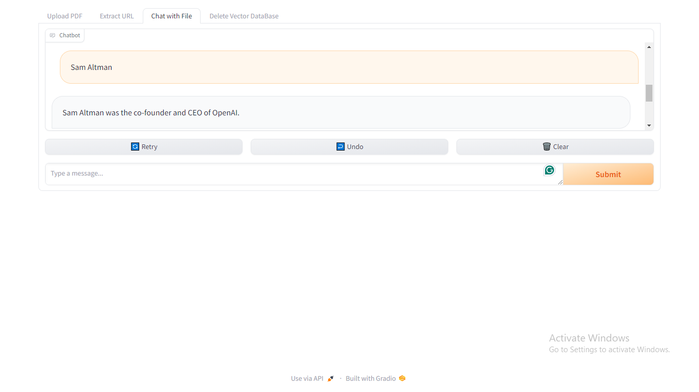

# Vector Data Extraction Tool

This project provides tools for extracting text data from PDF files, URLs, and supports conversational interactions with a language model based on OpenAI's GPT-3.5.

## Installation

1. Clone this repository.
2. Install dependencies by running `pip install -r requirements.txt`.
3. Ensure you have an OpenAI API key.
4. Create a `.env` file in the root directory of the project.
5. Add the following line to the `.env` file : OPENAI_API_KEY=your_api_key_here.
7. Replace `your_api_key_here` with your actual OpenAI API key
   
## Usage

### PDF Extractor

1. Launch the PDF Extractor interface.
2. Upload a PDF file.
3. Get the extracted text response.

### URL Extractor

1. Launch the URL Extractor interface.
2. Enter a URL containing text data.
3. Get the extracted text response.

### Chat with File

1. Launch the Chat with File interface.
2. Start a conversation with the language model based on the uploaded text data.
3. Receive responses from the language model.

### Delete Vector Database

1. Launch the Delete Vector Database interface.
2. Click the "Delete" button to delete data from the vector database.

## UI

## File Descriptions

- `main.py`: Contains the main code for running the interfaces and interacting with the language model.
- `src/`: Directory containing utility functions and modules.
- `vector_data_base/`: Directory containing vector data stored in a database.

## Contributing

Contributions are welcome! Please fork the repository, make your changes, and submit a pull request. For major changes, please open an issue first to discuss potential updates.

## License

This project is licensed under the [MIT License](LICENSE).

## Contact

For questions or support, please open an issue in the GitHub repository or contact [abhijitrajkumar2@gmail.com].
